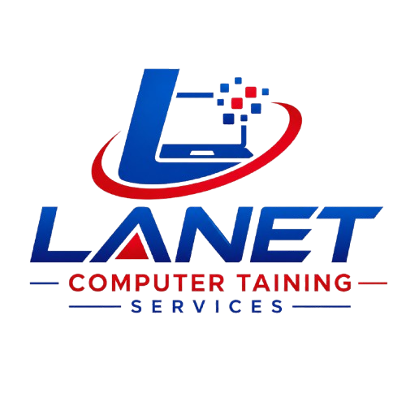
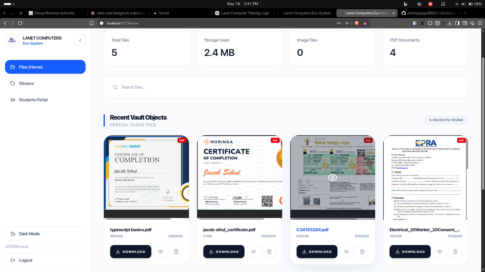

<p align="center">
  
</p>

<h1 align="center">🛰️ LANET COMPUTERS ECO-SYSTEM</h1>

<p align="center">
  <strong>A Modern Private Cloud Infrastructure for Cyber Cafés, Computer Labs, and Shared Workspaces</strong>
</p>

<p align="center">
  Built with React, TypeScript, Supabase, and Vercel
</p>

---

# 📖 Overview

LC-Ecosystem is a cloud-native file-sharing and workstation collaboration platform designed for cyber cafés, computer labs, training institutes, and shared computing environments.

The platform eliminates the traditional dependency on USB flash drives by providing a secure, centralized, and accessible digital ecosystem where users can instantly upload, retrieve, preview, and manage files across multiple terminals.

Designed with scalability, security, and usability in mind, LC-Ecosystem modernizes shared-computer environments through seamless cloud integration and a premium user experience.

---

# 🌍 Problem Statement

In many cyber cafés and institutional computer labs, file transfer still heavily depends on physical flash drives.

This traditional workflow introduces several challenges:

- Slow and inconvenient file movement between terminals
- High risk of malware and virus transmission
- Lost or damaged flash drives
- Lack of centralized file accessibility
- Poor collaboration between users
- Security and privacy concerns

LC-Ecosystem was developed to solve these problems by creating a lightweight private-cloud ecosystem optimized for local computer environments.

---

# 🚀 Core Features

## 🔐 Secure Authentication
- Terminal and user authentication powered by Supabase Auth
- Protected cloud access
- Session persistence and secure identity management

---

## ☁️ Cloud File Uploads
- Upload PDFs, images, documents, and media files
- Persistent cloud storage
- Instant file availability across all terminals

---

## 📱 Mobile Share Page (`/share`)
- Mobile-first public upload page for customer self-service
- Built for QR-code access (ideal for cyber-café walk-in uploads)
- Supports images, PDFs, Word documents, ZIP files, and videos
- Upload progress and upload success feedback
- Uploaded files are saved directly into the existing **Shared Files** vault
- Configurable upload limits via environment variables:
  - `VITE_SHARE_MAX_SIZE`
  - `VITE_SHARE_ALLOWED_TYPES`

---

## 🖼️ Built-in File Preview System
- Preview images directly in the browser
- Integrated PDF viewer
- Fast content accessibility without downloads

---

## 📊 Interactive Dashboard
- Real-time storage insights
- User contribution tracking
- Minimalist and responsive analytics UI

---

## 🎓 Students Management
- Dedicated **Students** tab in the main dashboard
- Add and update student records with:
  - Student name
  - Course
  - Fee paid
  - Expected total fee
- Automatic balance tracking and status labeling:
  - **Has Balance** when payment is pending
  - **Completed** when full fee is paid
- Shared visibility for authenticated users with owner-based update/delete controls

---

## 🌐 Cross-Device Accessibility
- Access uploaded content from any connected workstation
- Optimized for cyber-café and LAN-style workflows

---

## 🎨 Premium UI/UX
- Modern responsive design
- Interactive dot-grid visual system
- Smooth animations and transitions
- Mobile-friendly layouts

---

## ⚡ Persistent Infrastructure
- Hosted on Vercel
- PostgreSQL-powered persistence via Supabase
- Files remain accessible without local server dependency

---

## 🏷️ Custom Sticker Generator
- Support for three templates: **Pochi la Biashara**, **Lipa na M-Pesa (Till)**, and **Paybill (Paybill + Account)**
- High-fidelity canvas drawing to render custom details at locked, pixel-perfect coordinates
- Enforced strict maximum character length limits to prevent layout breaks:
  - **Paybill Number**: 6 characters maximum
  - **Pochi la Biashara Number**: 10 characters maximum
  - **Till Number**: 7 characters maximum
  - **Account Number/Name**: Unlimited (flexible references)
- Dual export capability: high-resolution **PNG** for digital shares and pixel-precise **PDF** (powered by `jsPDF`) for instant, edge-to-edge printing
- Sleek, input-only clean view interfaces with zero-lag instant canvas generation

---

# 🧠 System Architecture

LC-Ecosystem follows a modern cloud-native architecture:

```text
Client (React + TypeScript)
        ↓
Supabase Authentication
        ↓
PostgreSQL Database
        ↓
Supabase Cloud Storage
        ↓
Vercel Deployment Infrastructure
```

### Architecture Highlights
- Frontend served through Vercel CDN
- Cloud storage managed with Supabase Storage
- Metadata persistence handled by PostgreSQL
- Secure access policies using Row-Level Security (RLS)
- Fully serverless deployment workflow

------------------------

# 🛠️ Tech Stack

| Category | Technology |
|----------|------------|
| Frontend | React + Vite |
| Language | TypeScript |
| Styling | Tailwind CSS |
| Authentication | Supabase Auth |
| Database | PostgreSQL |
| Storage | Supabase Storage |
| Hosting | Vercel |
| State Management | React Hooks |
| Version Control | Git + GitHub |
| Document Export | jsPDF |

---------------------------

# 📸 Screenshots

> Add screenshots of:
- Login page
- Dashboard
- Upload interface
- File preview system
- Mobile responsiveness

Example:

```md

```

---

# ⚙️ Installation & Setup

## 1️⃣ Clone Repository

```bash
git clone https://github.com/geeksjayjay388/lc-ecosystem.git

cd lc-ecosystem
```

---

## 2️⃣ Install Dependencies

```bash
npm install
```

---

## 3️⃣ Install Tailwind Plugin

```bash
npm install @tailwindcss/vite
```

---

# 🔑 Environment Variables

Create a `.env` file in the root directory:

```env
VITE_SUPABASE_URL=YOUR_SUPABASE_PROJECT_URL
VITE_SUPABASE_ANON_KEY=YOUR_SUPABASE_ANON_KEY
```

> ⚠️ Environment variables must begin with `VITE_` to be exposed by Vite.

---

# 🗄️ Database & Storage Configuration

Open your Supabase dashboard and navigate to:

```text
SQL Editor → Run SQL Script
```

Execute the SQL setup file located at:

```text
src/lib/supabase.sql
```

This script creates:

- `ecosystem-vault` storage bucket
- `lc_files` database table
- Row-Level Security policies
- File access permissions

Ensure the storage bucket is configured correctly for your access requirements.

---

# ▶️ Run Development Server

```bash
npm run dev
```

Open:

```text
http://localhost:5173
```

The application supports hot-reloading during development.

---

# 📦 Production Build

```bash
npm run build
```

Preview production build locally:

```bash
npm run preview
```

---

# 🔒 Security Features

- Supabase Authentication
- Secure API environment variables
- Row-Level Security (RLS)
- Protected file access policies
- Persistent session management

---

# 🌟 Real-World Use Cases

LC-Ecosystem can be deployed in:

- Cyber cafés
- Computer training institutes
- Shared office environments
- Libraries
- School computer labs
- University workstations
- Community digital centers

---

# 💡 Future Improvements

Planned upgrades include:

- 🔄 Real-time synchronization
- 🖨️ Printing management system
- 💳 M-Pesa integration
- 📡 LAN-based local sync
- 🤖 AI-powered file categorization
- 📈 Advanced analytics dashboard
- 🖥️ Desktop companion application
- 👥 Multi-role administration system

---

# 📚 What I Learned

This project strengthened my understanding of:

- Cloud-native application development
- Authentication systems
- Database architecture
- File storage infrastructure
- Frontend system design
- TypeScript development
- Responsive UI engineering
- Production deployment workflows

---

# 🤝 Contributing

Contributions are welcome.

## Contribution Workflow

```bash
# Fork repository
# Create feature branch
git checkout -b feature/amazing-feature

# Commit changes
git commit -m "Add amazing feature"

# Push changes
git push origin feature/amazing-feature
```

Open a Pull Request describing your changes.

---

# 📄 License

Distributed under the MIT License.

See:

```text
LICENSE
```

for more information.

---

# 👨‍💻 Developer

### Engineer Jacob Sihul

Passionate about:
- Full-stack engineering
- Cloud systems
- AI integration
- Scalable digital ecosystems
- Solving real-world African technology problems

---

# ⭐ Support The Project

If you found this project useful:

- Star the repository
- Share feedback
- Contribute improvements
- Connect and collaborate

---

<p align="center">
  <strong>Empowering Shared Computing Through Modern Cloud Infrastructure</strong>
</p>